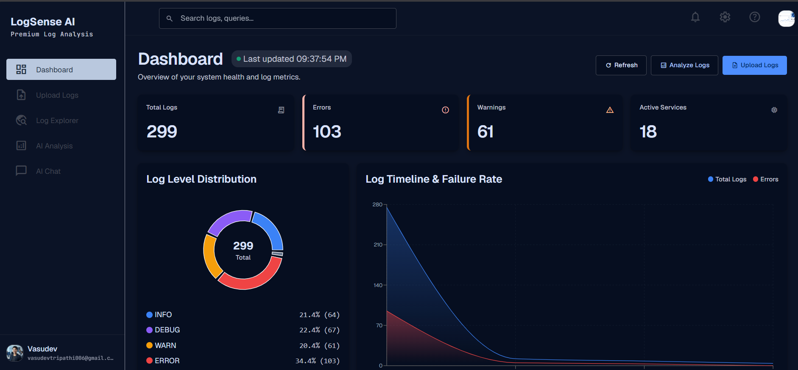
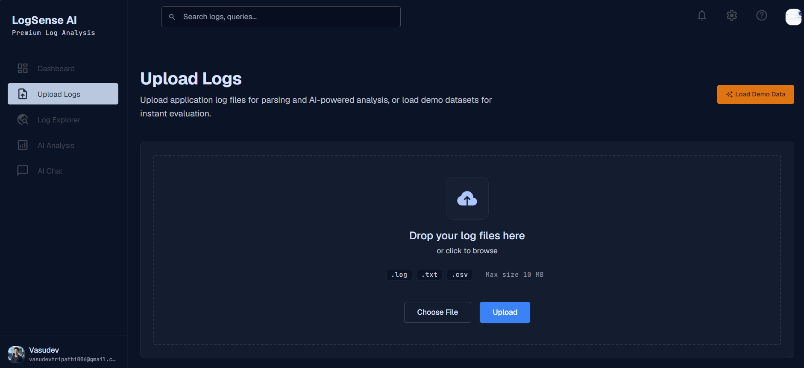
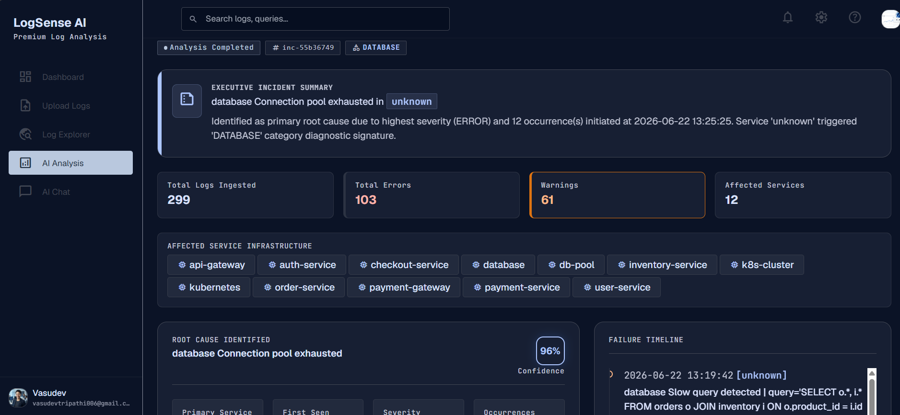
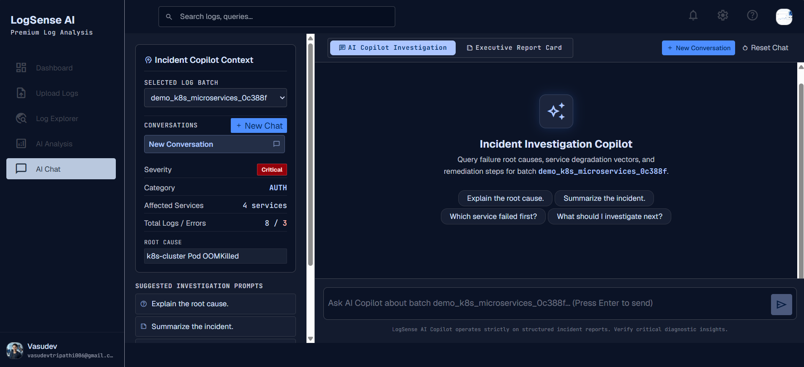
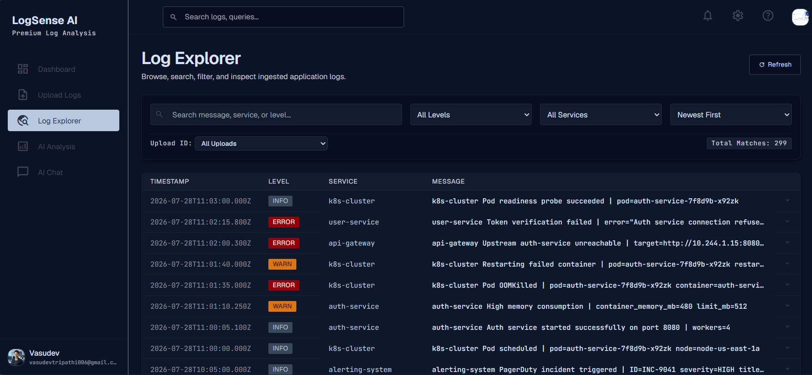
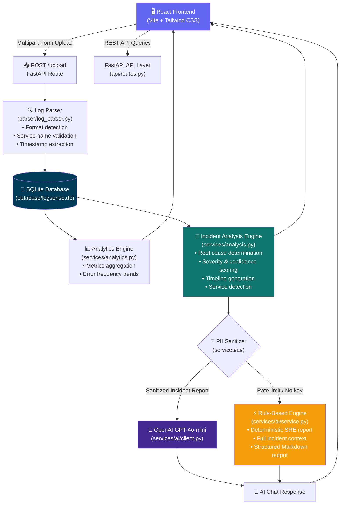

<div align="center">

<br />

# 🧠 LogSense AI

### AI-Powered Log Analysis, Incident Investigation & Root Cause Diagnosis Platform

<p align="center">
  <a href="https://github.com/VasudevTripathi/LogSense-AI/releases"></a>
  <a href="https://opensource.org/licenses/MIT"></a>
  <a href="#"></a>
</p>

<p align="center">
  <a href="https://fastapi.tiangolo.com"></a>
  <a href="https://react.dev"></a>
  <a href="https://vitejs.dev"></a>
  <a href="https://tailwindcss.com"></a>
  <a href="https://www.python.org"></a>
  <a href="https://openai.com"></a>
  <a href="https://www.sqlite.org"></a>
</p>

<p align="center">
  <a href="https://render.com"></a>
  <a href="https://vercel.com"></a>
</p>

<br />

> **LogSense AI** transforms raw application logs into structured, actionable SRE intelligence — combining a deterministic rule-based analysis engine with an OpenAI-powered diagnostic copilot, fully operable even without an AI subscription.

<br />

</div>

---

## Overview

Modern distributed systems generate thousands of log lines per second. When incidents occur, engineers spend critical minutes manually searching, filtering, and correlating logs from multiple services — time that should be spent resolving the failure.

**LogSense AI** automates this process end-to-end:

| Problem | LogSense AI Solution |
| :--- | :--- |
| Log files are unstructured and hard to parse | Multi-format parser normalizes `.log`, `.txt`, and `.csv` into structured records |
| Incident root cause is buried in noise | Deterministic Incident Analysis Engine ranks failure signatures by severity and frequency |
| AI tools require manual copy-paste of logs | Integrated AI Copilot is pre-loaded with structured incident context on every session |
| No OpenAI key? Analysis stops. | Full Rule-Based Investigation Mode activates automatically as a deterministic fallback |
| Post-incident reporting is manual | Executive Incident Reports export to Markdown, JSON, or PDF in one click |

**Who is this for?** Backend engineers, SRE teams, DevOps practitioners, and technical leads who want structured observability tooling without the operational complexity of a full SIEM platform.

---

## Key Features

<details>
<summary><strong>📥 Log Ingestion & Parsing</strong></summary>
<br />

- Upload `.log`, `.txt`, and `.csv` log files — multiple uploads supported
- Automatic extraction of `timestamp`, `log level`, `service name`, and `message`
- Microservice name validator prevents timestamps or log levels from being misclassified as service identifiers
- Positional, bracket-delimited, and colon-terminated service name extraction strategies
- Demo Dataset Loader for instant evaluation without uploading real logs

</details>

<details>
<summary><strong>📊 Dashboard & Analytics</strong></summary>
<br />

- Aggregated metrics: total logs ingested, error count, warning count, unique services affected
- Error frequency trend visualization powered by Recharts
- Per-upload breakdown with timestamps and file metadata
- Auto-refresh with last-updated timestamp

</details>

<details>
<summary><strong>🔍 Log Explorer</strong></summary>
<br />

- Full-text search across log messages
- Filter by log level (`ERROR`, `WARN`, `INFO`, `DEBUG`)
- Filter by service name and upload batch
- Paginated result view with sortable columns

</details>

<details>
<summary><strong>🎯 Incident Analysis Engine</strong></summary>
<br />

- Rule-based root cause determination (severity rank → frequency rank → earliest onset)
- Confidence scoring based on error signature consistency
- Affected service detection with strict timestamp exclusion validation
- Chronological incident timeline generation (top 15 key events)
- Top recurring error pattern aggregation with first/last seen timestamps
- Category classification: `DATABASE`, `NETWORK`, `AUTH`, `API`, `CACHE`, `FILESYSTEM`, `SECURITY`
- Automated SRE remediation recommendations per category

</details>

<details>
<summary><strong>🤖 AI Copilot & Rule-Based Fallback</strong></summary>
<br />

- OpenAI GPT-4o-mini powered interactive SRE chat
- Chat history preserved per upload session
- Automatic conversation thread titles
- **Rule-Based Investigation Mode**: Full deterministic fallback with identical output quality when OpenAI quota is reached — no degraded experience
- PII & credential sanitizer strips API keys, JWTs, Bearer tokens, IPs, emails before AI transmission

</details>

<details>
<summary><strong>📑 Export & Reporting</strong></summary>
<br />

- Export incident reports as Markdown (`.md`), JSON (`.json`), or printable PDF
- Executive Incident Card with severity, category, confidence, timeline, and recommendations

</details>

---

## Screenshots


| Dashboard | Upload & Ingestion |
|:-:|:-:|
|  |  |

| Incident Analysis | AI Copilot Chat |
|:-:|:-:|
|  |  |

| Log Explorer |
|:-:|
|  |

---

## Architecture



---

## Folder Structure

```
LogSense AI/
├── backend/
│   ├── api/
│   │   └── routes.py              # All FastAPI route handlers
│   ├── database/
│   │   ├── models.py              # SQLite table schema definitions
│   │   └── operations.py         # CRUD database operations
│   ├── parser/
│   │   └── log_parser.py         # Multi-format log parser + service name validator
│   ├── services/
│   │   ├── analysis.py           # Incident Analysis Engine (root cause, timeline, confidence)
│   │   ├── analytics.py          # Dashboard aggregation & metrics
│   │   └── ai/
│   │       ├── client.py         # OpenAI API client wrapper
│   │       ├── prompt.py         # Chat prompt builder
│   │       ├── sanitizer.py      # PII / credential masking
│   │       └── service.py        # AI orchestration + Rule-Based fallback engine
│   ├── demo_data/
│   │   ├── ecommerce_incident.log # Bundled e-commerce demo logs
│   │   └── k8s_microservices.log  # Bundled Kubernetes demo logs
│   ├── models/
│   │   └── schemas.py            # Pydantic request/response models
│   ├── tests/
│   │   ├── test_operational_readiness.py
│   │   └── test_rule_based_engine.py
│   ├── config.py                 # Centralized environment config (Pydantic-validated)
│   ├── main.py                   # FastAPI application entrypoint
│   ├── requirements.txt
│   ├── .env.example
│   └── uploads/                  # Ephemeral file upload staging directory
│
├── frontend/
│   ├── src/
│   │   ├── components/
│   │   │   ├── AIPerformanceCard.jsx     # AI telemetry + Rule Engine badge
│   │   │   ├── ConfidenceMeter.jsx
│   │   │   ├── ExecutiveIncidentCard.jsx
│   │   │   ├── Header.jsx
│   │   │   ├── IncidentTimeline.jsx
│   │   │   ├── MarkdownRenderer.jsx
│   │   │   ├── MultiStageLoader.jsx
│   │   │   └── Sidebar.jsx
│   │   ├── pages/
│   │   │   ├── AIAnalysis.jsx    # Incident Analysis page
│   │   │   ├── AIChat.jsx        # AI Copilot chat (per-upload thread persistence)
│   │   │   ├── Dashboard.jsx     # Metrics dashboard with refresh
│   │   │   ├── LogExplorer.jsx   # Paginated log search & filter
│   │   │   └── UploadLogs.jsx    # Upload + Danger Zone + Demo Data loader
│   │   ├── services/
│   │   │   └── api.js            # Axios API client (VITE_API_URL configurable)
│   │   └── App.jsx
│   ├── .env.example
│   ├── tailwind.config.js
│   └── vite.config.js
│
├── render.yaml                   # Render.com backend deployment manifest
├── .gitignore
└── README.md
```

---

## Tech Stack

| Layer | Technology | Purpose |
| :--- | :--- | :--- |
| **API Framework** | [FastAPI](https://fastapi.tiangolo.com) `0.139+` | High-performance async HTTP API with automatic OpenAPI docs |
| **Runtime** | Python `3.10+` | Type-annotated, async-native backend |
| **Data Validation** | [Pydantic v2](https://docs.pydantic.dev) | Request/response schema validation and config management |
| **Database** | SQLite3 | Embedded zero-config persistence for logs and metadata |
| **AI Provider** | [OpenAI API](https://platform.openai.com) `GPT-4o-mini` | Contextual SRE chat, anchored on incident reports |
| **Frontend Framework** | [React 18](https://react.dev) + [Vite](https://vitejs.dev) `5.x` | SPA with fast HMR development experience |
| **Styling** | [Tailwind CSS](https://tailwindcss.com) `3.4` | Utility-first design system |
| **Charts** | [Recharts](https://recharts.org) | Error trend and metric visualizations |
| **HTTP Client** | [Axios](https://axios-http.com) | Frontend REST API communication |
| **Backend Deployment** | [Render](https://render.com) | Containerized Python service hosting |
| **Frontend Deployment** | [Vercel](https://vercel.com) | Edge-optimized static site hosting |

---

## Installation

### Prerequisites

- **Python** `3.10+`
- **Node.js** `18+` and `npm`
- **OpenAI API Key** _(optional — Rule-Based Mode activates automatically without one)_

### 1. Clone the Repository

```bash
git clone https://github.com/VasudevTripathi/LogSense-AI.git
cd LogSense-AI
```

### 2. Backend Setup

```bash
cd backend

# Create and activate a virtual environment
python -m venv .venv
source .venv/bin/activate        # macOS / Linux
.\.venv\Scripts\activate         # Windows

# Install Python dependencies
pip install -r requirements.txt

# Configure environment variables
cp .env.example .env
# Edit .env and set your OPENAI_API_KEY (see Environment Variables section)

# Start the development server
python -m uvicorn main:app --reload --host 0.0.0.0 --port 8000
```

API is available at `http://localhost:8000`  
Interactive API docs at `http://localhost:8000/docs`

### 3. Frontend Setup

```bash
cd frontend

# Install Node dependencies
npm install

# Configure frontend environment
cp .env.example .env
# Set VITE_API_URL=http://localhost:8000

# Start Vite development server
npm run dev
```

Application is available at `http://localhost:5173`

---

## Deployment

### Backend → Render

The repository includes a ready-to-deploy [`render.yaml`](./render.yaml):

```yaml
services:
  - type: web
    name: logsense-ai-backend
    runtime: python
    rootDir: backend
    buildCommand: pip install -r requirements.txt
    startCommand: uvicorn main:app --host 0.0.0.0 --port $PORT
    healthCheckPath: /health
```

1. Connect your GitHub repository on [Render](https://render.com)
2. Render auto-detects `render.yaml` and configures the service
3. Set environment variables (see table below) in the Render dashboard

### Frontend → Vercel

1. Import the repository on [Vercel](https://vercel.com)
2. Set **Root Directory** to `frontend`
3. Vercel auto-detects Vite — Build: `npm run build`, Output: `dist`
4. Set `VITE_API_URL` to your Render backend URL in Vercel environment settings

---

## Environment Variables

### Backend (`backend/.env`)

| Variable | Required | Default | Description |
| :--- | :---: | :--- | :--- |
| `OPENAI_API_KEY` | No | — | OpenAI API key. If unset, Rule-Based Mode activates automatically |
| `OPENAI_MODEL` | No | `gpt-4o-mini` | OpenAI model identifier |
| `OPENAI_MAX_TOKENS` | No | `1000` | Maximum completion token budget per request |
| `OPENAI_TEMPERATURE` | No | `0.7` | Sampling temperature for AI responses |
| `ENVIRONMENT` | No | `development` | Runtime environment (`development` \| `production`) |
| `HOST` | No | `0.0.0.0` | Server bind address |
| `PORT` | No | `8000` | Server listen port |
| `CORS_ORIGINS` | No | `http://localhost:5173,...` | Comma-separated list of allowed CORS origins |

### Frontend (`frontend/.env`)

| Variable | Required | Default | Description |
| :--- | :---: | :--- | :--- |
| `VITE_API_URL` | No | `http://localhost:8000` | Backend API base URL |

---

## API Endpoints

| Method | Endpoint | Description | Response Codes |
| :--- | :--- | :--- | :--- |
| `GET` | `/` | API metadata and version | `200` |
| `GET` | `/health` | Health check (DB + AI service status) | `200` |
| `POST` | `/upload` | Upload and ingest a log file | `200`, `400`, `500` |
| `GET` | `/dashboard` | Aggregated dashboard metrics | `200` |
| `GET` | `/logs` | Paginated log search with filters | `200` |
| `GET` | `/logs/meta` | Filter dropdown metadata | `200` |
| `DELETE` | `/logs` | Delete all ingested logs | `200` |
| `DELETE` | `/uploads/{upload_id}` | Delete a specific upload batch | `200`, `404` |
| `POST` | `/analyze` | Run Incident Analysis Engine on an upload | `200`, `404` |
| `POST` | `/ai/chat` | AI Copilot chat turn | `200`, `400`, `404`, `429`, `500`, `504` |
| `POST` | `/demo/load` | Load bundled demo log dataset | `200`, `500` |

> Full interactive documentation available at `/docs` (Swagger UI) and `/redoc` when the backend is running.

---

## AI Workflow

```
1. Upload
   └─▶ POST /upload
         └─▶ log_parser.py
               • Detects format (.log / .txt / .csv)
               • Validates service names (rejects timestamps, log levels)
               • Persists structured records to SQLite

2. Analyze
   └─▶ POST /analyze
         └─▶ analysis.py (Incident Analysis Engine)
               • Normalizes logs
               • Aggregates error signatures by frequency + severity
               • Detects affected microservices
               • Calculates root cause, confidence score, category
               • Builds chronological incident timeline
               • Generates SRE remediation recommendations

3. Chat
   └─▶ POST /ai/chat
         ├─▶ PII Sanitizer (strips credentials, tokens, IPs)
         ├─▶ Prompt Builder (injects full incident report as context)
         │
         ├─▶ [Primary Path] OpenAI GPT-4o-mini
         │     └─▶ Contextual SRE Q&A response
         │
         └─▶ [Fallback Path] Rule-Based Engine
               └─▶ Deterministic SRE report (identical structure, no external dependency)

4. Frontend
   └─▶ React renders Markdown response, telemetry card, timeline, and export options
```

---

## Rule-Based Investigation Mode

LogSense AI is designed for **zero-dependency operation**. When the OpenAI API is unavailable, rate-limited, or unconfigured, the system automatically activates **Rule-Based Investigation Mode** — a fully deterministic SRE diagnostic engine built into the backend.

This is not a degraded fallback. The output is structurally identical to the AI-generated response:

| Section | Rule-Based Engine Output |
| :--- | :--- |
| **Status Banner** | `⚡ Rule-Based Investigation Mode` indicator |
| **Incident Telemetry** | Severity, Confidence, Category, Primary Service, First/Last Seen, Occurrences |
| **Aggregate Statistics** | Total Logs, Errors, Warnings, Affected Service Count |
| **Root Cause Analysis** | Primary diagnosis extracted from the highest-severity error signature |
| **Incident Timeline** | Chronological event table (timestamp → level → service → message) |
| **Top Error Patterns** | Ranked error signatures with frequency and time bounds |
| **Remediation Plan** | Category-mapped, step-by-step SRE action items |

**Why this matters for production teams**: AI quota exhaustion should never block an active incident investigation. Rule-Based Mode ensures LogSense AI is always operational.

---

## Performance

| Component | Characteristic |
| :--- | :--- |
| **FastAPI** | Async request handling; non-blocking I/O for file uploads and DB queries |
| **Log Parser** | Single-pass regex extraction; processes hundreds of log lines in milliseconds |
| **SQLite** | Embedded DB with zero connection overhead; suitable for single-instance deployments |
| **Incident Analysis Engine** | O(n) normalization + O(k log k) error aggregation where k = unique error signatures |
| **OpenAI Integration** | Configurable `max_tokens` and `temperature`; request timeout enforced |
| **Rule-Based Engine** | Fully synchronous; deterministic O(1) output generation from pre-computed incident report |
| **React + Vite** | Optimized production bundle under 800 kB gzip; code-split by route |

---

## Roadmap

- [ ] **Multi-file Batch Upload** — concurrent ingestion of multiple log files in a single request
- [ ] **PostgreSQL Support** — configurable database backend for scalable multi-instance deployments
- [ ] **Real-time Log Streaming** — WebSocket ingestion endpoint for live log tailing
- [ ] **Alert Rules Engine** — configurable threshold-based alerting on error frequency or severity spikes
- [ ] **Team Collaboration** — shareable incident report links and annotation support
- [ ] **Log Retention Policies** — configurable TTL-based automatic log expiry
- [ ] **Custom AI Personas** — domain-specific SRE prompt profiles (Kubernetes, AWS, Django, etc.)
- [ ] **SIEM Integration** — export to Splunk, Datadog, or Elasticsearch

---

## Running Tests

```bash
# Backend — all unit tests (Incident Analysis, API Endpoints, Rule-Based Engine, Operational Readiness)
cd backend
python -m unittest discover -s tests -v

# Frontend — production build validation
cd frontend
npm run build
```

Current test coverage: **34 backend unit tests** across infrastructure, API endpoints, incident analysis, and rule-based engine modules.

---

## Contributing

Contributions are welcome. Please follow these steps:

1. Fork the repository
2. Create a feature branch: `git checkout -b feat/your-feature-name`
3. Commit with a conventional message: `git commit -m "feat: add real-time log streaming"`
4. Push to your fork: `git push origin feat/your-feature-name`
5. Open a Pull Request — describe the problem, solution, and any test coverage added

Please ensure `python -m unittest discover -s backend/tests` and `npm run build` pass before submitting.

---

## License

Distributed under the [MIT License](https://opensource.org/licenses/MIT). See `LICENSE` for full terms.

---

## Author

**Vasudev Tripathi**

<p>
  <a href="https://github.com/VasudevTripathi"></a>
  &nbsp;
  <a href="https://linkedin.com/in/VasudevTripathi"></a>
</p>

---

<div align="center">

_Built with precision. Designed for production._

⭐ If LogSense AI is useful to you, consider starring the repository.

</div>
